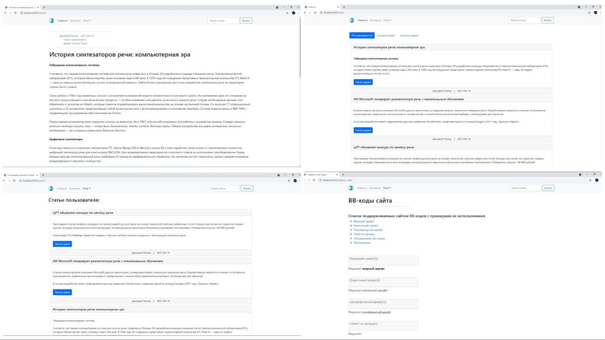

# News site

In this project, a server application for a news site has developed and tested. Authors can create and edit articles. Readers - view articles and lists of articles by various authors, leave comments, search.

## Used technologies

- [JDK 16](https://www.oracle.com/java/technologies/javase/jdk16-archive-downloads.html)
- [Apache Maven](https://maven.apache.org/)
- [Spring Boot](https://spring.io/projects/spring-boot)
- - [Spring Data Jpa](https://spring.io/projects/spring-data-jpa)
- - [Spring Security](https://spring.io/projects/spring-security)
- - [Spring Testing](https://docs.spring.io/spring-framework/docs/current/reference/html/testing.html)
- [Thymeleaf](https://www.thymeleaf.org/)
- [Hibernate Validator](https://hibernate.org/validator/)
- [Jwt](https://jwt.io/)
- [Lombok](https://projectlombok.org/)
- [SL4J](https://www.slf4j.org/)
- [Logback](https://logback.qos.ch/)
- [PostgreSQL](https://www.postgresql.org/)
- HTML5, CSS3, JS, [Bootstrap](https://getbootstrap.com/)
- [jQuery](https://jquery.com/)

## How to set up this project on your computer

- Install [JDK 16](https://www.oracle.com/java/technologies/javase/jdk16-archive-downloads.html) and [PostgreSQL](https://www.postgresql.org/)
- Clone [this](https://github.com/Popov-Dmitry/news-site) repository
- In file `./src/main/resources/application.properties` change parameters for accessing the database:
- - `spring.datasource.url`
- - `spring.datasource.username`
- - `spring.datasource.password`
- - `jwt.secret-key`
- - `jwt.expiration`

## Site pages

- `/news` - main page of the site with all articles
- `/news/{id}` - article view page
- `/news/new` - article creation page
- `/search` - search results page
- `/users/{id}` - user page with all articles written by him
- `/auth/reg` - registration page
- `/auth` - authorization page
- `/help/bb_codes` - help on bb-codes of the site
- `/contacts` - contacts page

User interface examples:

