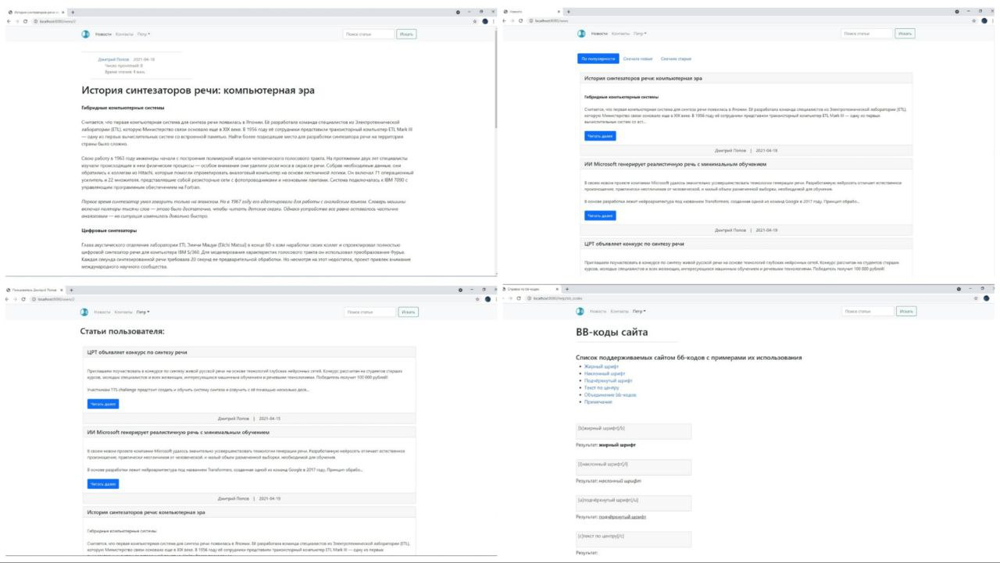

# Новостной сайт

В данном проекте было разработано и протестированы серверное приложение новостного сайта. Авторы могут создавать и редактировать статьи. Читатели - просматривать статьи и списки статей различных авторов, оставлять комментарии, осуществлять поиск.

## Использованные технологии

- [JDK 16](https://www.oracle.com/java/technologies/javase/jdk16-archive-downloads.html)
- [Apache Maven](https://maven.apache.org/)
- [Spring Boot](https://spring.io/projects/spring-boot)
- - [Spring Data Jpa](https://spring.io/projects/spring-data-jpa)
- - [Spring Security](https://spring.io/projects/spring-security)
- - [Spring Testing](https://docs.spring.io/spring-framework/docs/current/reference/html/testing.html)
- [Thymeleaf](https://www.thymeleaf.org/)
- [Hibernate Validator](https://hibernate.org/validator/)
- [Jwt](https://jwt.io/)
- [Lombok](https://projectlombok.org/)
- [SL4J](https://www.slf4j.org/)
- [Logback](https://logback.qos.ch/)
- [PostgreSQL](https://www.postgresql.org/)
- HTML5, CSS3, JS, [Bootstrap](https://getbootstrap.com/)
- [jQuery](https://jquery.com/)

## Как настроить проект на вашем компьютере

- Установить [JDK 16](https://www.oracle.com/java/technologies/javase/jdk16-archive-downloads.html) и [PostgreSQL](https://www.postgresql.org/) (все необходимые таблицы создадуться при запуске автоматически)
- Клонировать [этот](https://github.com/Popov-Dmitry/news-site) репозиторий
- В файле `./src/main/resources/application.properties` изменить параметры для доступа к БД:
- - `spring.datasource.url` - url-адрес подключения к БД
- - `spring.datasource.username` - имя пользователя
- - `spring.datasource.password` - пароль пользователя
- - `jwt.secret-key` - секретный ключ, используемый в jwt
- - `jwt.expiration` - время жизни jwt

## Страницы сайта

- `/news` - главная страница сайта со всеми статьями
- `/news/{id}` - страница просмотра статьи
- `/news/new` - страница создания статьи
- `/search` - страница с результатами поиска
- `/users/{id}` - страница пользователя со всеми написаными им статьями
- `/auth/reg` - страница регистрации
- `/auth` - страница авторизации
- `/help/bb_codes` - справка по bb-кодам сайта
- `/contacts` - справка контактов

Примеры пользовательского интерфейса:

